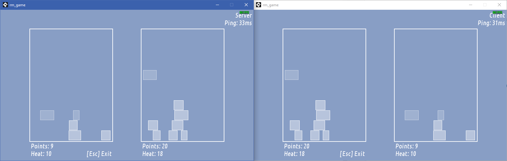

# Fields for two
There is this sort of a two-player game where each player does their own thing
and they occasionally influence each other - like
Tetris, Puyo Puyo, or even Shovel Knight Pocket Dungeon.

This is an example for doing such a thing (in GameMaker).

## Theory
Each player (game) field runs its own deterministic simulation.

Whenever something happens locally (such as initial setup, player actions, timers, and so on - a "turn"),
we apply it on our end and send a copy to the other player to replicate along with a random number generator seed to use;  
On our end, the remote field does not do anything unless instructed;  
This ensures that the remote field remains in sync (even if we're seeing its state from a split-second ago).

To interact with the other player,
we send an "attack" turn
and they apply it as an "attacked" turn.
This ensures the "attack" applies after the same turn on both sides.

As for networking itself,
the example includes a simple "network adapter" system with TCP and Steamworks implementations.

## The "game"
This time I decided to _not_ make an off-spec Tetris clone,
so you get a pseudo-game that features each of the key elements:

- Variously-sized blocks spawn on the top of the screen and fall down, stacking together.
- You lose if the blocks pile up all the way to the top of the screen.
- You can click on the blocks to destroy them.  
  Falling blocks are worth 2 points, stale blocks are worth 1.
- Regardless of whether you hit a block, clicking slightly increases the fall speed.
- You can click on the other player's field to spend 3 points to spawn a couple extra blocks for them.
- You can hold Shift to make the blocks fall faster.

Rest assured, for a "real" game you'll want to replace this with your own rules.

## Setting up

- Open the GameMaker project  
  (as of writing, I have used LTS IDE v2022.0.2.51 and runtime v2022.0.2.49)
- Open Extensions ➜ Steamworks and change Steamworks SDK path to your own  
  (with the extension version used, that should be Steamworks SDK 1.55)
- Run two copies of the game and have a look!  
  To test Steam, you'll need to open the second copy on another computer or in Sandboxie - Steam won't let you connect to yourself.

## Credits

Example by YellowAfterlife

Originally done as a research project for **Bing Bang Studio**, released with permission.